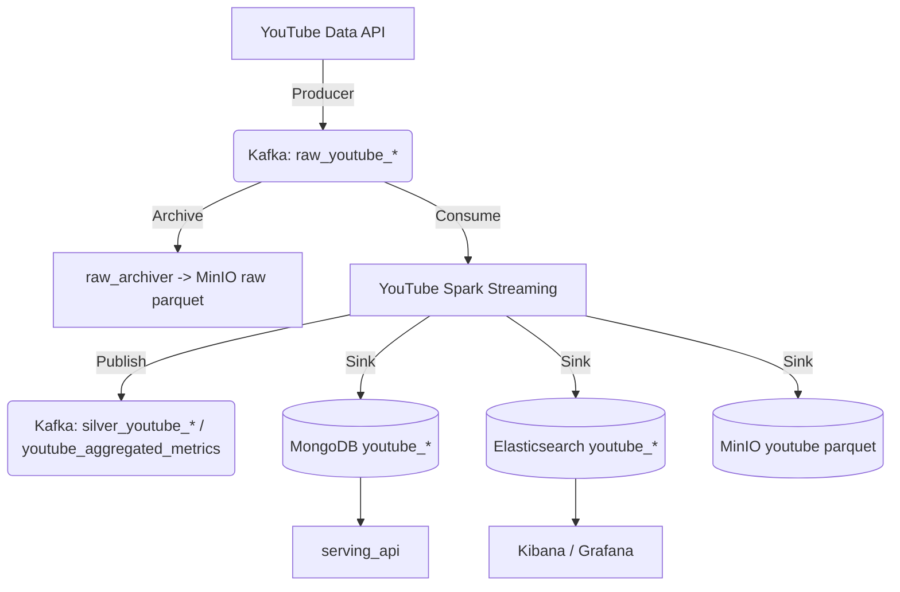

# Social Media Analytics - YouTube Architecture

Tài liệu này mô tả kiến trúc Kappa hiện tại của dự án sau khi chỉ giữ lại YouTube pipeline.

## Data Flow

## Thành phần

- **Ingestion**: `collectors.youtube.producer` thu thập video trending, search results, comments và channel snapshots.
- **Message Broker**: Kafka tách ingest khỏi processing bằng các raw topics riêng cho video, comment, channel.
- **Stream Processing**: `spark_jobs/youtube/stream_processor.py` chuẩn hóa entity, gán sentiment, tính trending keywords và aggregated metrics.
- **Storage**:
  - MongoDB cho operational reads của `serving_api`
  - Elasticsearch cho search và dashboard
  - MinIO cho raw archive, parquet sinks và checkpoints
- **Serving**: `serving_api` chỉ expose read APIs cho dashboard/frontend YouTube.
